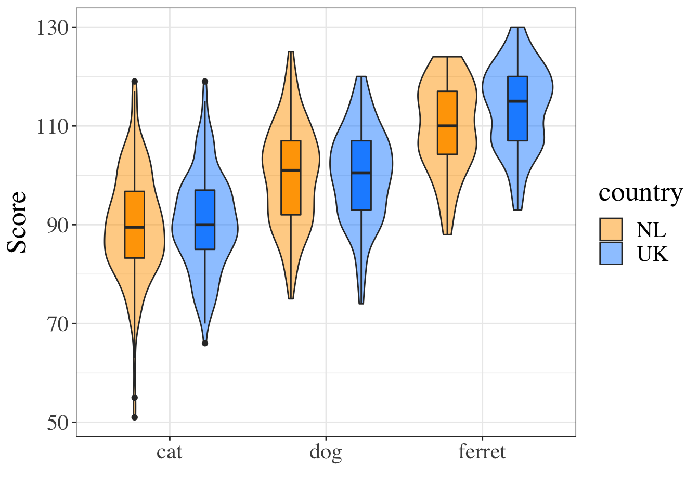

# Reproducible Workflows {#repro}

<div class="right meme"></div>

## Learning Objectives {#ilo-repro}

### Basic {-}

1. Organise a [project](#projects) [(video)](https://youtu.be/y-KiPueC9xw ){class="video"}
2. Create and compile an [Rmarkdown document](#rmarkdown) [(video)](https://youtu.be/EqJiAlJAl8Y ){class="video"}
3. Edit the YAML header to add table of contents and other options
4. Include a table 
5. Include a figure 
6. Report the output of an analysis using inline R
7. Add a bibliography and in-line citations

### Intermediate {-}

8. Output doc and PDF formats
9. Format tables using `kableExtra`


## Setup {#setup-repro}


```r
library(tidyverse)
library(knitr)
```

## Why learn reproducible reports?

Have you ever worked on a report, creating a summary table for the demographics, making beautiful plots, getting the analysis just right, and copying all the relevant numbers into your manuscript, only to find out that you forgot to exclude a test run and have to redo everything?

An R Markdown document produces a <a class='glossary' target='_blank' title='The extent to which the findings of a study can be repeated in some other context' href='https://psyteachr.github.io/glossary/r#reproducibility'>reproducible</a> report that fixes this problem. Although this requires a bit of extra effort at the start, it will more than pay you back by allowing you to update your entire report with the push of a button whenever anything changes.

Studies also show that many, if not most, papers in the scientific literature have reporting errors. For example, more than half of over 250,000 psychology papers published between 1985 and 2013 have at least one value that is statistically incompatible (e.g., a p-value that is not possible given a t-value and degrees of freedom) [@nuijten2016prevalence]. Reproducible reports help avoid transcription and rounding errors.

We will make reproducible reports following the principles of [literate programming](https://en.wikipedia.org/wiki/Literate_programming). The basic idea is to have the text of the report together in a single document along with the code needed to perform all analyses and generate the tables. The report is then "compiled" from the original format into some other, more portable format, such as HTML or PDF. This is different from traditional cutting and pasting approaches where, for instance, you create a graph in Microsoft Excel or a statistics program like SPSS and then paste it into Microsoft Word.

## Organising a project {#projects}

First, we need to get organised. <a class='glossary' target='_blank' title='A way to organise related files in RStudio' href='https://psyteachr.github.io/glossary/p#project'>Projects</a> in RStudio are a way to group all of the files you need for one project. Most projects include scripts, data files, and output files like the PDF report created by the script or images. 

### File System

Modern computers tend to hide the file system from users, but we need to understand a little bit about how files are stored on your computer in order to get a script to find your data. Your computer's file system is like a big box (or <a class='glossary' target='_blank' title='A collection or "folder" of files on a computer.' href='https://psyteachr.github.io/glossary/d#directory'>directory</a>) that contains both files and smaller boxes, or "subdirectories". You can specify the location of a file with its name and the names of all the directories it is inside.

For example, if Lisa is looking for a file called `report.Rmd`on their Desktop, they can specify the full file <a class='glossary' target='_blank' title='A string representing the location of a file or directory.' href='https://psyteachr.github.io/glossary/p#path'>path</a> like this: `/Users/lisad/Desktop/report.Rmd`, because the `Desktop` directory is inside the `lisad` directory, which is inside the `Users` directory, which is located at the base of the whole file system. If that file was on *your* desktop, you would probably have a different path unless your user directory is also called `lisad`. You can also use the `~` shortcut to represent the user directory of the person who is currently logged in, like this: `~/Desktop/report.Rmd`.

### Working Directory

Where should you put all of your files? You usually want to have all of your scripts and data files for a single project inside one folder on your computer, the <a class='glossary' target='_blank' title='The filepath where R is currently reading and writing files.' href='https://psyteachr.github.io/glossary/w#working-directory'>working directory</a> for that project. You can organise files in subdirectories inside this main project directory, such as putting all raw data files in a directory called <code class='path'>data</code> and saving any image files to a directory called <code class='path'>images</code>.

Your script should only reference files in three locations, using the appropriate format.

| Where                    | Example                                                          |
|--------------------------|------------------------------------------------------------------|
| on the web               | "<https://psyteachr.github.io/ads-v1/data/widgets_gadgets.xlsx>" |
| in the working directory | "widgets_gadgets.xlsx"                                           |
| in a subdirectory        | "data/widgets_gadgets.xlsx"                                      |

::: {.warning data-latex=""}
Never set or change your working directory in a script.
:::

R Markdown files will automatically use the same directory the .Rmd file is in as the working directory.

If your script needs a file in a subdirectory of your working directory, such as, <code class='path'>data/widgets_gadgets.xlsx</code>, load it in using a <a class='glossary' target='_blank' title='The location of a file in relation to the working directory.' href='https://psyteachr.github.io/glossary/r#relative-path'>relative path</a> so that it is accessible if you move the working directory to another location or computer:


```r
dat <- read_csv("data/widgets_gadgets.xlsx")  # correct
```

Do not load it in using an <a class='glossary' target='_blank' title='A file path that starts with / and is not appended to the working directory' href='https://psyteachr.github.io/glossary/a#absolute-path'>absolute path</a>:


```r
dat <- read_csv("C:/My Files/2020-2021/data/widgets_gadgets.xlsx")   # wrong
```

::: {.info data-latex=""}
Also note the convention of using forward slashes, unlike the Windows-specific convention of using backward slashes. This is to make references to files work for everyone, regardless of their operating system.
:::

### Naming Things

Name files so that both people and computers can easily find things. Here are some important principles:

-   file and directory names should only contain letters, numbers, dashes, and underscores, with a full stop (`.`) between the file name and <a class='glossary' target='_blank' title='The end part of a file name that tells you what type of file it is (e.g., .R or .Rmd).' href='https://psyteachr.github.io/glossary/e#extension'>extension</a> (that means no spaces!)
-   be consistent with capitalisation (set a rule to make it easy to remember, like always use lowercase)
-   use underscores (`_`) to separate parts of the file name, and dashes (`-`) to separate words in a section
-   name files with a pattern that alphabetises in a sensible order and makes it easy for you to find the file you're looking for
-   prefix a filename with an underscore to move it to the top of the list, or prefix all files with numbers to control their order

For example, these file names are a mess:

-   <code class='path'>report.doc</code>
-   <code class='path'>report final.doc</code>
-   <code class='path'>Data (Customers) 11-15.xls</code>
-   <code class='path'>Customers Data Nov 12.xls</code>
-   <code class='path'>final report2.doc</code>
-   <code class='path'>project notes.txt</code>
-   <code class='path'>Vendor Data November 15.xls</code>

Here is one way to structure them so that similar files have the same structure and it's easy for a human to scan the list or to use code to find relevant files. See if you can figure out what the last one should be.

-   <code class='path'>_project-notes.txt</code>
-   <code class='path'>report_v1.doc</code>
-   <code class='path'>report_v2.doc</code>
-   <code class='path'>report_v3.doc</code>
-   <code class='path'>data_customer_2021-11-12.xls</code>
-   <code class='path'>data_customer_2021-11-15.xls</code>
-   <select class='webex-select'><option value='blank'></option><option value=''>vendor-data_2021-11-15.xls</option><option value=''>data-vendor-2021_11_15.xls</option><option value='answer'>data_vendor_2021-11-15.xls</option><option value=''>data_2021-11-15_vendor.xls</option></select>

::: {.try data-latex=""}
Think of other ways to name the files above. Look at some of your own project files and see what you can improve.
:::

### Start a Project

Now that we understand how the file system work and how to name things to make it easier for scripts to access them, we're ready to make our first project. 

First, make a new <a class='glossary' target='_blank' title='A collection or "folder" of files on a computer.' href='https://psyteachr.github.io/glossary/d#directory'>directory</a> where you will keep all of your materials for this class. You can set this directory to be the default working directory under the General tab of the Global Options. This means that files will be saved here by default if you aren't working in a project. 

Next, choose **`New Project...`** under the **`File`** menu to create a new project called <code class='path'>02-reports</code>. Make sure you save it inside the directory you just made. RStudio will restart itself and open with this new project directory as the working directory. 


```r
include_graphics(c("images/repro/new_proj_1.png",
                   "images/repro/new_proj_2.png",
                   "images/repro/new_proj_3.png"))
```

<div class="figure" style="text-align: center">

<p class="caption">(\#fig:unnamed-chunk-2-1)Starting a new project.</p>
</div><div class="figure" style="text-align: center">

<p class="caption">(\#fig:unnamed-chunk-2-2)Starting a new project.</p>
</div><div class="figure" style="text-align: center">

<p class="caption">(\#fig:unnamed-chunk-2-3)Starting a new project.</p>
</div>

Click on the Files tab in the lower right pane to see the contents of the project directory. You will see a file called `02-reports.Rproj`, which is a file that contains all of the project information.You can double-click on it to open up the project. 

::: {.info data-latex=""}
Depending on your settings, you may also see a directory called `.Rproj.user`, which contains your specific user settings. You can ignore this and other "invisible" files that start with a full stop.
:::

## R Markdown

In this lesson, we will learn to make an R Markdown document with a table of contents, appropriate headers, code chunks, tables, images, inline R, and a bibliography. 

We will use <a class='glossary' target='_blank' title='The R-specific version of markdown: a way to specify formatting, such as headers, paragraphs, lists, bolding, and links, as well as code blocks and inline code.' href='https://psyteachr.github.io/glossary/r#r-markdown'>R Markdown</a> to create reproducible reports, which enables mixing of text and code. A reproducible script will contain sections of code in code blocks. A code block starts and ends with three backtick symbols in a row, with some information about the code between curly brackets, such as `{r chunk-name, echo=FALSE}` (this runs the code, but does not show the text of the code block in the compiled document). The text outside of code blocks is written in <a class='glossary' target='_blank' title='A way to specify formatting, such as headers, paragraphs, lists, bolding, and links.' href='https://psyteachr.github.io/glossary/m#markdown'>markdown</a>, which is a way to specify formatting, such as headers, paragraphs, lists, bolding, and links.

<div class="figure" style="text-align: center">

<p class="caption">(\#fig:img-reproducible-script)A reproducible script.</p>
</div>

If you open up a new R Markdown file from a template, you will see an example document with several code blocks in it. To create an HTML or PDF report from an R Markdown (Rmd) document, you compile it.  Compiling a document is called <a class='glossary' target='_blank' title='To create an HTML, PDF, or Word document from an R Markdown (Rmd) document' href='https://psyteachr.github.io/glossary/k#knit'>knitting</a> in RStudio. There is a button that looks like a ball of yarn with needles through it that you click on to compile your file into a report. 

::: {.try data-latex=""}
Create a new R Markdown file from the **`File > New File > R Markdown...`** menu. Change the title and author, then click the knit button to create an html file.
:::


### YAML Header

The <a class='glossary' target='_blank' title='A structured format for information' href='https://psyteachr.github.io/glossary/y#yaml'>YAML</a> header is where you can set several options. 

```
---
title: "My Demo Document"
author: "Me"
output:
  html_document:
    df_print: kable
    theme: 
      version: 4
      bootswatch: yeti
    highlight: tango
    toc: true
    toc_float:
      collapsed: false
      smooth_scroll: false
    toc_depth: 3
    number_sections: false
---
```

::: {.info data-latex=""}
Try changing the values from `false` to `true` to see what the options do.
:::

The `df_print: kable` option prints data frames using `knitr::kable`. You'll learn below how to further customise tables.

The built-in bootswatch themes are: default, cerulean, cosmo, darkly, flatly, journal, lumen, paper, readable, sandstone, simplex, spacelab, united, and yeti. You can [view and download more themes](https://bootswatch.com/4/).

<div class="figure" style="text-align: center">

<p class="caption">(\#fig:img-bootswatch)Light themes in versions 3 and 4.</p>
</div>


### Setup

When you create a new R Markdown file in RStudio, a setup chunk is automatically created.

<div class='verbatim'><pre class='sourceCode r'><code class='sourceCode R'>&#96;&#96;&#96;{r setup, include=FALSE}</code></pre>

```r
knitr::opts_chunk$set(echo = TRUE)
```

<pre class='sourceCode r'><code class='sourceCode R'>&#96;&#96;&#96;</code></pre></div>

You can set more default options for code chunks here. See the [knitr options documentation](https://yihui.name/knitr/options/){target="_blank"} for explanations of the possible options.

<div class='verbatim'><pre class='sourceCode r'><code class='sourceCode R'>&#96;&#96;&#96;{r setup, include=FALSE}</code></pre>

```r
knitr::opts_chunk$set(
  fig.width  = 8, 
  fig.height = 5, 
  fig.path   = 'images/',
  echo       = FALSE, 
  warning    = TRUE, 
  message    = FALSE,
  cache      = FALSE
)
```

<pre class='sourceCode r'><code class='sourceCode R'>&#96;&#96;&#96;</code></pre></div>

The code above sets the following options:

* `fig.width  = 8` : default figure width is 8 inches (you can change this for individual figures)
* `fig.height = 5` : default figure height is 5 inches
* `fig.path   = 'images/'` : figures are saved in the directory "images"
* `echo       = FALSE` : do not show code chunks in the rendered document
* `warning    = FALSE` : do not show any function warnings
* `message    = FALSE` : do not show any function messages
* `cache      = FALSE` : run all the code to create all of the images and objects each time you knit (set to `TRUE` if you have time-consuming code)


Find a list of the current chunk options by typing <code><span class='fu'><a href='https://rdrr.io/r/utils/str.html'>str</a></span><span class='op'>(</span><span class='fu'>knitr</span><span class='fu'>::</span><span class='va'><a href='https://rdrr.io/pkg/knitr/man/opts_chunk.html'>opts_chunk</a></span><span class='op'>$</span><span class='fu'>get</span><span class='op'>(</span><span class='op'>)</span><span class='op'>)</span></code> in the console.


You can also add the packages you need in this chunk using <code><span class='kw'><a href='https://rdrr.io/r/base/library.html'>library</a></span><span class='op'>(</span><span class='op'>)</span></code>. Often when you are working on a script, you will realize that you need to load another add-on package. Don't bury the call to `library(package_I_need)` way down in the script. Put it in the top, so the user has an overview of what packages are needed.

::: {.try data-latex=""}
We'll be using function from the package <code class='package'>tidyverse</code>, so load that in your setup chunk.
:::

### Structure {#structure}

If you include a table of contents (`toc`), it is created from your document headers. Headers in <a class='glossary' target='_blank' title='A way to specify formatting, such as headers, paragraphs, lists, bolding, and links.' href='https://psyteachr.github.io/glossary/m#markdown'>markdown</a> are created by prefacing the header title with one or more hashes (`#`). 

Use the following structure when developing your own analysis scripts: 

* load in any add-on packages you need to use
* define any custom functions
* load or simulate the data you will be working with
* work with the data
* save anything you need to save

::: {.try data-latex=""}
Delete the default text and add some structure to your document by creating headers and subheaders. We're going to load some data, create a summary table, plot the data, and analyse it.
:::

### Code Chunks

You can include <a class='glossary' target='_blank' title='A section of code in an R Markdown file' href='https://psyteachr.github.io/glossary/c#chunk'>code chunks</a> that create and display images, tables, or computations to include in your text. Let's start by loading some data.

First, create a code chunk in your document. This code loads some data from the web. 


```r
pets <- read_csv("https://psyteachr.github.io/reprores/data/pets.csv")
```

```
## Rows: 800 Columns: 6
## ── Column specification ────────────────────────────────────────────────────────
## Delimiter: ","
## chr (3): id, pet, country
## dbl (3): score, age, weight
## 
## ℹ Use `spec()` to retrieve the full column specification for this data.
## ℹ Specify the column types or set `show_col_types = FALSE` to quiet this message.
```

#### Comments

You can add comments inside R chunks with the hash symbol (`#`). The R interpreter will ignore characters from the hash to the end of the line.


```r
# simulating new data

n <- nrow(pets) # the total number of pet
mu <- mean(pets$score) # the mean score for all pets
sd <- sd(pets$score) # the SD for score for all pets

simulated_scores <- rnorm(n, mu, sd)
```

It's usually good practice to start a code chunk with a comment that explains what you're doing there, especially if the code is not explained in the text of the report.

If you name your objects clearly, you often don't need to add clarifying comments. For example, if I'd named the three objects above `total_pet_n`, `mean_score` and `sd_score`, I would omit the comments.

It's a bit of an art to comment your code well. The best way to develop this skill is to read a lot of other people's code and have others review your code. 

#### Tables

Next, create a code chunk where you want to display a table of the descriptives (e.g., Participants section of the Methods). We'll use tidyverse functions you will learn in the [data wrangling lectures](#tidyr) to create summary statistics for each group.


```r
pets %>%
  group_by(pet) %>%
  summarise(
    n = n(),
    mean_weight = mean(weight),
    mean_score = mean(score)
  )
```

<div class="kable-table">

<table>
 <thead>
  <tr>
   <th style="text-align:left;"> pet </th>
   <th style="text-align:right;"> n </th>
   <th style="text-align:right;"> mean_weight </th>
   <th style="text-align:right;"> mean_score </th>
  </tr>
 </thead>
<tbody>
  <tr>
   <td style="text-align:left;"> cat </td>
   <td style="text-align:right;"> 300 </td>
   <td style="text-align:right;"> 9.371613 </td>
   <td style="text-align:right;"> 90.23667 </td>
  </tr>
  <tr>
   <td style="text-align:left;"> dog </td>
   <td style="text-align:right;"> 400 </td>
   <td style="text-align:right;"> 19.067974 </td>
   <td style="text-align:right;"> 99.98250 </td>
  </tr>
  <tr>
   <td style="text-align:left;"> ferret </td>
   <td style="text-align:right;"> 100 </td>
   <td style="text-align:right;"> 4.781569 </td>
   <td style="text-align:right;"> 111.78000 </td>
  </tr>
</tbody>
</table>

</div>

The table above is OK, but it could be more reader-friendly by changing the column labels, rounding the means, and adding a caption. You can use <code><span class='fu'>knitr</span><span class='fu'>::</span><span class='fu'><a href='https://rdrr.io/pkg/knitr/man/kable.html'>kable</a></span><span class='op'>(</span><span class='op'>)</span></code> for this.


```r
summary_table <-pets %>%
  group_by(pet) %>%
  summarise(
    n = n(),
    mean_weight = mean(weight),
    mean_score = mean(score)
  )

newnames <- c("Pet Type", "N", "Mean Weight", "Mean Score")

knitr::kable(summary_table, 
             digits = 2, 
             col.names = newnames,
             caption = "Summary statistics for the pets dataset.")
```

<table>
<caption>(\#tab:unnamed-chunk-6)Summary statistics for the pets dataset.</caption>
 <thead>
  <tr>
   <th style="text-align:left;"> Pet Type </th>
   <th style="text-align:right;"> N </th>
   <th style="text-align:right;"> Mean Weight </th>
   <th style="text-align:right;"> Mean Score </th>
  </tr>
 </thead>
<tbody>
  <tr>
   <td style="text-align:left;"> cat </td>
   <td style="text-align:right;"> 300 </td>
   <td style="text-align:right;"> 9.37 </td>
   <td style="text-align:right;"> 90.24 </td>
  </tr>
  <tr>
   <td style="text-align:left;"> dog </td>
   <td style="text-align:right;"> 400 </td>
   <td style="text-align:right;"> 19.07 </td>
   <td style="text-align:right;"> 99.98 </td>
  </tr>
  <tr>
   <td style="text-align:left;"> ferret </td>
   <td style="text-align:right;"> 100 </td>
   <td style="text-align:right;"> 4.78 </td>
   <td style="text-align:right;"> 111.78 </td>
  </tr>
</tbody>
</table>


::: {.info data-latex=""}
Notice that the r chunk specifies the option `results='asis'`. This lets you format the table using the `kable()` function from `knitr`. You can also use more specialised functions from [papaja](https://crsh.github.io/papaja_man/reporting.html#tables) or [kableExtra](https://haozhu233.github.io/kableExtra/awesome_table_in_html.html) to format your tables.
:::

#### Images

Next, create a code chunk where you want to display an image in your document. Let's put it in the Results section. We'll use some code that you'll learn more about  in the [data visualisation lecture](#ggplot) to show violin-boxplots for the groups.

Notice how the figure caption is formatted in the chunk options.

````

```r
ggplot(pets, aes(pet, score, fill = country)) +
  geom_violin(alpha = 0.5) +
  geom_boxplot(width = 0.25, 
               position = position_dodge(width = 0.9),
               show.legend = FALSE) +
  scale_fill_manual(values = c("orange", "dodgerblue")) +
  xlab("") +
  ylab("Score") +
  theme(text = element_text(size = 20, family = "Times"))
```

<div class="figure" style="text-align: center">

<p class="caption">(\#fig:unnamed-chunk-7)Figure 1. Scores by pet type and country.</p>
</div>
````

<div class="figure" style="text-align: center">

<p class="caption">(\#fig:unnamed-chunk-8)Figure 1. Scores by pet type and country.</p>
</div>

::: {.info data-latex=""}
The last line changes the default text size and font, which can be useful for generating figures that meet a journal's requirements.
:::


You can also include images that you did not create in R using the typical markdown syntax for images: 

```
](images/memes/x-all-the-things.png){style="width: 50%"}
```

](images/memes/x-all-the-things.png){style="width: 50%"}

#### In-line R

Now let's analyse the pets data to see if cats are heavier than ferrets. First we'll run the analysis code. Then we'll save any numbers we might want to use in our manuscript to variables and round them appropriately. Finally, we'll use <code><span class='fu'>glue</span><span class='fu'>::</span><span class='fu'><a href='https://glue.tidyverse.org/reference/glue.html'>glue</a></span><span class='op'>(</span><span class='op'>)</span></code> to format a results string.


```r
# analysis
cat_weight <- filter(pets, pet == "cat") %>% pull(weight)
ferret_weight <- filter(pets, pet == "ferret") %>% pull(weight)
weight_test <- t.test(cat_weight, ferret_weight)

# round individual values you want to report
t <- weight_test$statistic %>% round(2)
df <- weight_test$parameter %>% round(1)
p <- weight_test$p.value %>% round(3)
# handle p-values < .001
p_symbol <- ifelse(p < .001, "<", "=")
if (p < .001) p <- .001

# format the results string
weight_result <- glue::glue("t = {t}, df = {df}, p {p_symbol} {p}")
```

You can insert the results into a paragraph with inline R code that looks like this: 

<pre><code>Cats were significantly heavier than ferrets (&#96;r weight_result&#96;).</code></pre>

**Rendered text:**  
Cats were significantly heavier than ferrets (t = 18.42, df = 180.4, p < 0.001). 


### Bibliography

There are several ways to do in-text citations and automatically generate a [bibliography](https://rmarkdown.rstudio.com/authoring_bibliographies_and_citations.html#bibliographies) in R Markdown. Markdown files need a BibTex file that contains the references you need to cite. You specify the name of this file in the YAML header, like `bibliography: filename.bib` and reference citations in text using an at symbol and a shortname, like `[@tidyverse]`.

#### Converting from reference software

Most reference software like EndNote, Zotero or Mendeley have exporting options that can export to BibTeX format. You just need to check the shortnames in the resulting file.

#### Create a BibTeX File Manually

You can make a BibTeX file and add citations manually. Make a new Text File in RStudio called "bibliography.bib".

Next, add the line `bibliography: bibliography.bib` to your YAML header.

You can add citations in the following format:

```
@article{shortname,
  author = {Author One and Author Two and Author Three},
  title = {Paper Title},
  journal = {Journal Title},
  volume = {vol},
  number = {issue},
  pages = {startpage--endpage},
  year = {year},
  doi = {doi}
}
```

#### Citing R packages

You can get the citation for an R package using the functions `citation()` and `toBibtex()`. You can paste the bibtex entry into your bibliography.bib file. Make sure to add a short name (e.g., "faux") before the first comma to refer to the reference.


```r
citation(package="faux") %>% toBibtex()
```

```
## @Manual{,
##   title = {faux: Simulation for Factorial Designs},
##   author = {Lisa DeBruine},
##   doi = {10.5281/zenodo.2669586},
##   publisher = {Zenodo},
##   year = {2022},
##   note = {R package version 1.1.0.9004},
##   url = {https://debruine.github.io/faux/},
## }
```


#### Download Citation Info

[Google Scholar](https://scholar.google.com/) entries have a BibTeX citation option. This is usually the easiest way to get the relevant values, although you have to add the DOI yourself. 

Some journal websites also let you download citations in bibtex format. For example, go to the publisher's page for [Equivalence Testing for Psychological Research: A Tutorial](https://journals.sagepub.com/doi/abs/10.1177/2515245918770963){target="_blank"}, click on the Cite button (in the sidebar or under the bottom Explore More menu), choose BibTeX format, and download the citation. You can open up the file in a text editor and copy the text. It should look like this:

```
@article{doi:10.1177/2515245918770963,
author = {Daniël Lakens and Anne M. Scheel and Peder M. Isager},
title ={Equivalence Testing for Psychological Research: A Tutorial},
journal = {Advances in Methods and Practices in Psychological Science},
volume = {1},
number = {2},
pages = {259-269},
year = {2018},
doi = {10.1177/2515245918770963},

URL = { 
        https://doi.org/10.1177/2515245918770963
    
},
eprint = { 
        https://doi.org/10.1177/2515245918770963
    
}
,
    abstract = { Psychologists must be able to test both for the presence of an effect and for the absence of an effect. In addition to testing against zero, researchers can use the two one-sided tests (TOST) procedure to test for equivalence and reject the presence of a smallest effect size of interest (SESOI). The TOST procedure can be used to determine if an observed effect is surprisingly small, given that a true effect at least as extreme as the SESOI exists. We explain a range of approaches to determine the SESOI in psychological science and provide detailed examples of how equivalence tests should be performed and reported. Equivalence tests are an important extension of the statistical tools psychologists currently use and enable researchers to falsify predictions about the presence, and declare the absence, of meaningful effects. }
}
```

Paste the reference into your bibliography.bib file. Change `doi:10.1177/2515245918770963` in the first line of the reference to a shortname you will use to cite the reference in your manuscript. We'll use `TOSTtutorial`.


#### In-text citations

You can cite reference in text like this: 

```
This tutorial uses several R packages [@tidyverse;@rmarkdown].
```

This tutorial uses several R packages [@tidyverse;@rmarkdown].

Put a minus in front of the @ if you just want the year:

```
Lakens, Scheel and Isengar [-@TOSTtutorial] wrote a tutorial explaining how to test for the absence of an effect.
```

Lakens, Scheel and Isengar [-@TOSTtutorial] wrote a tutorial explaining how to test for the absence of an effect.

#### Citation Styles

You can search a [list of style files](https://www.zotero.org/styles){target="_blank"} for various journals and download a file that will format your bibliography for a specific journal's style. You'll need to add the line `csl: filename.csl` to your YAML header. 

::: {.info data-latex=""}
Add some citations to your bibliography.bib file, reference them in your text, and render your manuscript to see the automatically generated reference section. Try a few different citation style files.
:::


### Output Formats

You can knit your file to PDF or Word if you have the right packages installed on your computer. You can also create presentations, dashboards, websites, and even books with R markdown. In fact, the book you are reading right now was created using R markdown. See [RStudio Formats](https://rmarkdown.rstudio.com/formats.html){target="_blank"} for a list of all the output types.


## Glossary {#glossary-repro}

<table class="table" style="margin-left: auto; margin-right: auto;">
 <thead>
  <tr>
   <th style="text-align:left;"> term </th>
   <th style="text-align:left;"> definition </th>
  </tr>
 </thead>
<tbody>
  <tr>
   <td style="text-align:left;"> [absolute path](https://psyteachr.github.io/glossary/a.html#absolute-path){class="glossary" target="_blank"} </td>
   <td style="text-align:left;"> A file path that starts with / and is not appended to the working directory </td>
  </tr>
  <tr>
   <td style="text-align:left;"> [chunk](https://psyteachr.github.io/glossary/c.html#chunk){class="glossary" target="_blank"} </td>
   <td style="text-align:left;"> A section of code in an R Markdown file </td>
  </tr>
  <tr>
   <td style="text-align:left;"> [directory](https://psyteachr.github.io/glossary/d.html#directory){class="glossary" target="_blank"} </td>
   <td style="text-align:left;"> A collection or "folder" of files on a computer. </td>
  </tr>
  <tr>
   <td style="text-align:left;"> [extension](https://psyteachr.github.io/glossary/e.html#extension){class="glossary" target="_blank"} </td>
   <td style="text-align:left;"> The end part of a file name that tells you what type of file it is (e.g., .R or .Rmd). </td>
  </tr>
  <tr>
   <td style="text-align:left;"> [knit](https://psyteachr.github.io/glossary/k.html#knit){class="glossary" target="_blank"} </td>
   <td style="text-align:left;"> To create an HTML, PDF, or Word document from an R Markdown (Rmd) document </td>
  </tr>
  <tr>
   <td style="text-align:left;"> [markdown](https://psyteachr.github.io/glossary/m.html#markdown){class="glossary" target="_blank"} </td>
   <td style="text-align:left;"> A way to specify formatting, such as headers, paragraphs, lists, bolding, and links. </td>
  </tr>
  <tr>
   <td style="text-align:left;"> [path](https://psyteachr.github.io/glossary/p.html#path){class="glossary" target="_blank"} </td>
   <td style="text-align:left;"> A string representing the location of a file or directory. </td>
  </tr>
  <tr>
   <td style="text-align:left;"> [project](https://psyteachr.github.io/glossary/p.html#project){class="glossary" target="_blank"} </td>
   <td style="text-align:left;"> A way to organise related files in RStudio </td>
  </tr>
  <tr>
   <td style="text-align:left;"> [r markdown](https://psyteachr.github.io/glossary/r.html#r-markdown){class="glossary" target="_blank"} </td>
   <td style="text-align:left;"> The R-specific version of markdown: a way to specify formatting, such as headers, paragraphs, lists, bolding, and links, as well as code blocks and inline code. </td>
  </tr>
  <tr>
   <td style="text-align:left;"> [relative path](https://psyteachr.github.io/glossary/r.html#relative-path){class="glossary" target="_blank"} </td>
   <td style="text-align:left;"> The location of a file in relation to the working directory. </td>
  </tr>
  <tr>
   <td style="text-align:left;"> [reproducibility](https://psyteachr.github.io/glossary/r.html#reproducibility){class="glossary" target="_blank"} </td>
   <td style="text-align:left;"> The extent to which the findings of a study can be repeated in some other context </td>
  </tr>
  <tr>
   <td style="text-align:left;"> [working directory](https://psyteachr.github.io/glossary/w.html#working-directory){class="glossary" target="_blank"} </td>
   <td style="text-align:left;"> The filepath where R is currently reading and writing files. </td>
  </tr>
  <tr>
   <td style="text-align:left;"> [yaml](https://psyteachr.github.io/glossary/y.html#yaml){class="glossary" target="_blank"} </td>
   <td style="text-align:left;"> A structured format for information </td>
  </tr>
</tbody>
</table>


## Further Resources {#resources-repro}

* [Chapter 27: R Markdown](http://r4ds.had.co.nz/r-markdown.html) in *R for Data Science*
* [R Markdown Cheat Sheet](https://github.com/rstudio/cheatsheets/raw/master/rmarkdown.pdf)
* [R Markdown reference Guide](https://www.rstudio.com/wp-content/uploads/2015/03/rmarkdown-reference.pdf)
* [R Markdown Tutorial](https://rmarkdown.rstudio.com/lesson-1.html)
* [R Markdown: The Definitive Guide](https://bookdown.org/yihui/rmarkdown/) by Yihui Xie, J. J. Allaire, & Garrett Grolemund
* [Project Structure](https://slides.djnavarro.net/project-structure/) by Danielle Navarro
* [How to name files](https://speakerdeck.com/jennybc/how-to-name-files) by Jenny Bryan
* [Papaja](https://crsh.github.io/papaja_man/) Reproducible APA Manuscripts
* [The Turing Way](https://the-turing-way.netlify.app/)
